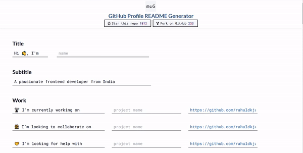

<p align="center">
  <a href="https://rahuldkjain.github.io/gh-profile-readme-generator">
    
  </a>
</p>
<h1 align="center">
  GitHub Profile Readme Generator
</h1>

<p align="center">
<a href="https://github.com/rahuldkjain/github-profile-readme-generator/blob/master/LICENSE" target="blank">

</a>
<a href="https://github.com/rahuldkjain/github-profile-readme-generator/fork" target="blank">

</a>
<a href="https://github.com/rahuldkjain/github-profile-readme-generator/stargazers" target="blank">

</a>
<a href="https://github.com/rahuldkjain/github-profile-readme-generator/issues" target="blank">

</a>
<a href="https://github.com/rahuldkjain/github-profile-readme-generator/pulls" target="blank">

</a>
<a href="https://discord.gg/U7YU3J" target="blank">

</a>
</p>

<p align="center"></p>

<p align="center">
    <a href="https://rahuldkjain.github.io/gh-profile-readme-generator" target="blank">View Demo</a>
    ·
    <a href="https://github.com/rahuldkjain/github-profile-readme-generator/issues/new/choose">Report Bug</a>
    ·
    <a href="https://github.com/rahuldkjain/github-profile-readme-generator/issues/new/choose">Request Feature</a>
</p>

<p align="center">
<i>Loved the tool? Please consider <a href="https://paypal.me/rahuldkjain">donating</a>  💸 to help it improve!</i>
</p>

#### Tired of editing GitHub Profile README with new features?

This tool provides an easy way to create a GitHub profile readme with the latest add-ons such as `visitors count`, `github stats`, etc.

#### 🚀 Try it out: [Live demo](https://rahuldkjain.github.io/gh-profile-readme-generator)

## 🧐 Features

Just fill in the details such as `Name`, `Tagline`, `Dev Platforms Username`, `Current Work`, `Portfolio`, `Blog`, etc. with a minimal UI.

Click on `Generate README` to get your README in `markdown`.
You can preview the README too.

You can add the latest add-ons such as `visitors count`, `shields`, `dev icons`, `github stats`, etc. to your README in just one click.

## Installation Steps

1. Clone the repository

```bash
git clone https://github.com/rahuldkjain/github-profile-readme-generator.git
```

2. Change the working directory

```bash
cd github-profile-readme-generator
```

3. Install dependencies

```bash
npm install
```

4. Run the app

```bash
npm start
```

🌟 You are all set!

## Special Thanks 🙇

- [Anurag Hazra](https://github.com/anuraghazra) for amazing [github-readme-stats](https://github.com/anuraghazra/github-readme-stats)
- [Anton Komarev](https://github.com/antonkomarev) for super cool [github-profile-views-counter](https://github.com/antonkomarev/github-profile-views-counter)
- [Gautam Krishna R](https://github.com/gautamkrishnar) for the awesome [blog post workflow](https://github.com/gautamkrishnar/blog-post-workflow)
- [Julien Monty](https://github.com/konpa) for super useful [devicon](https://github.com/konpa/devicon)

## Sponsors 🙇

- [Scott C Wilson](https://github.com/scottcwilson) donated the first-ever grant to this tool. A big thanks to him.
- [Max Schmitt](https://github.com/mxschmitt) loved the tool and showed support with his donation. Thanks a lot.

## Support 🙏

<p align="left">
<a href="https://www.paypal.me/rahuldkjain">
</a>
<a href="https://twitter.com/intent/tweet?text=Wow:&url=https%3A%2F%2Frahuldkjain.github.io%2Fgithub-profile-readme-generator">

</a>
</p>

<p align="left">
  <a href='https://ko-fi.com/A0A81XXSX' target='_blank'>
  </a>
  <a href="https://www.buymeacoffee.com/rahuldkjain" target="_blank">
</p>

<hr>
<p align="center">
Developed with ❤️ in India 🇮🇳 
</p>
